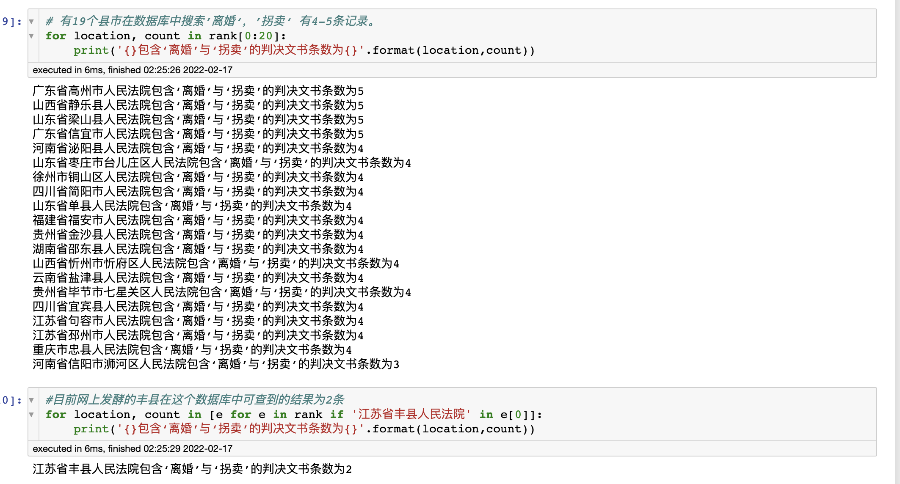

# 拐卖情况分析 human-trafficking-analysis

本文旨在通过公开数据寻找拐卖情况存疑地区，将各地区根据基层人民法院判决中有‘拐卖’和‘离婚’这两个关键字的民事案件条目数进行排序。

这里的假设是如果一个地区与‘拐卖‘有关的离婚事件多，那么此地区可能存在拐卖情况。

注：一个地区排名靠前不可推导出该地区拐卖盛行的结论，仅为存疑。

This repo utilize data from the Supreme People's Court to find places that might have human trafficking activity.

## 数据 data

数据来源(data source)： https://wenshu.court.gov.cn/

本文使用的数据均来自此最高人民法院的中国裁判文书网。裁判文书库公布的裁判文书由相关法院录入和审核，并依据法律与审判公开的原则予以公开。提供的信息仅供参考，非法使用裁判文书库给他人造成损害的，由非法使用人承担法律责任。因网站规定不得建立裁判文书库的镜像，这里不附带原始数据。

本文数据为在此网站中利用‘拐卖’，‘离婚’为关键词，搜索基层法院民事案件所得条目，仅供参考。

*某地区有‘拐卖’，‘离婚’等关键词，并不代表此地区是收买被拐妇女地区。最终结果数据也未根据区域人口数量进行调整。*

## 参考结果 result

目前备受关注丰县，这样的数据有两条。另有19个地区这样的数据有4-5条。

